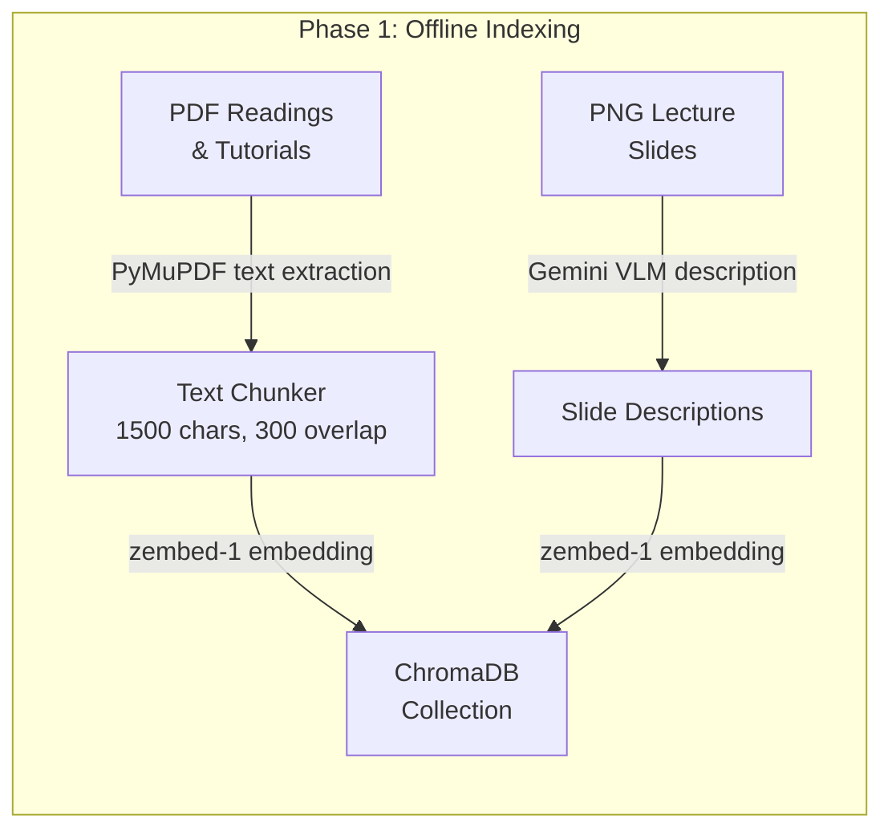
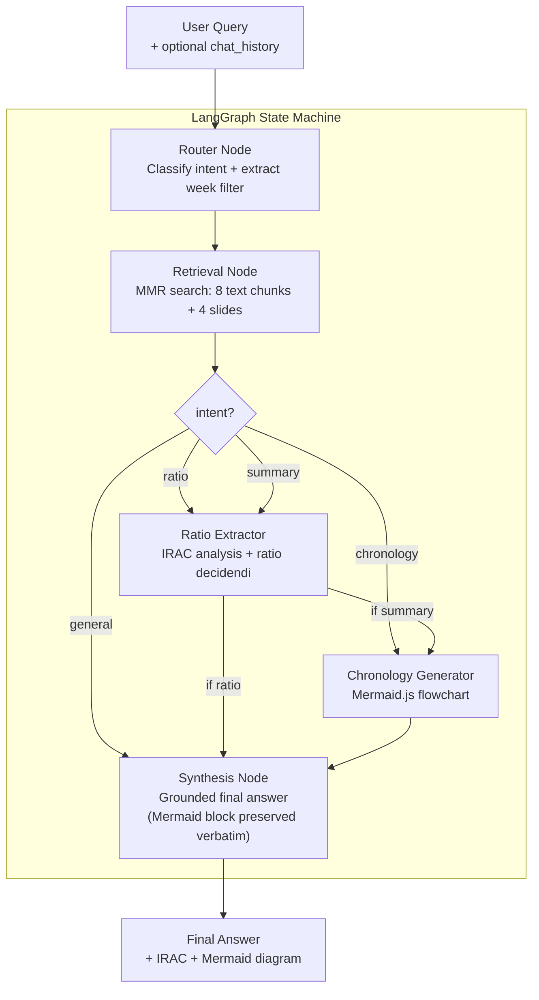
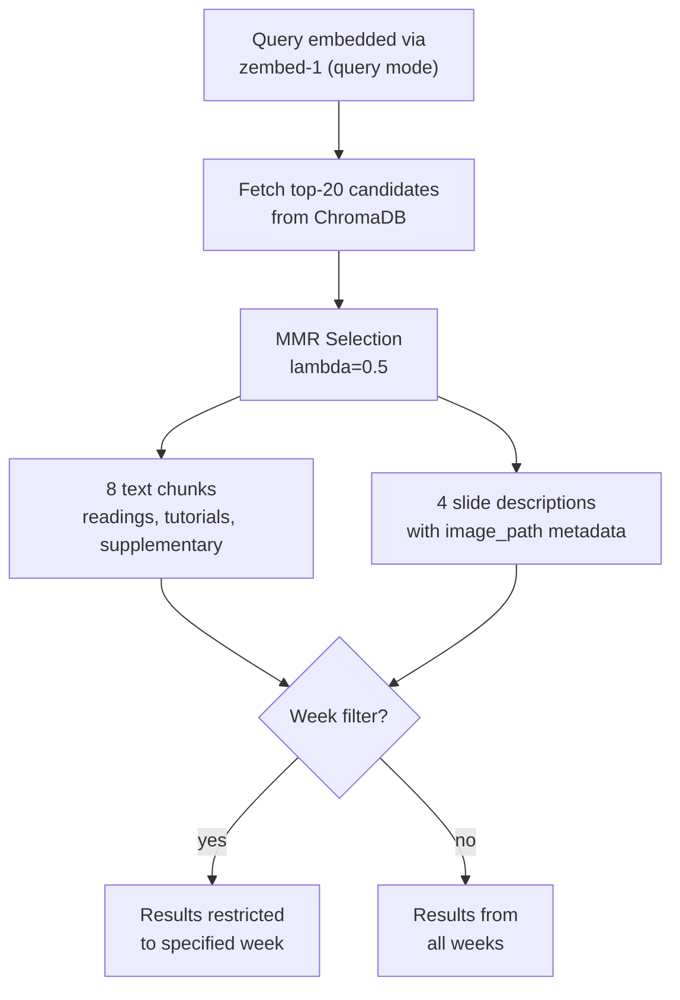
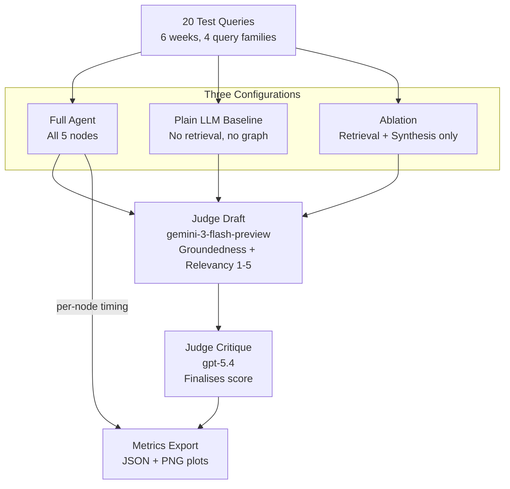

# Architecture

## System Overview

ashGPT is a multimodal LangGraph agent that processes property law queries through a conditional state machine. The architecture separates retrieval, legal rule extraction, and chronological analysis into distinct cognitive nodes, enabling ablation studies and independent evaluation of each component.

Multi-turn conversation is supported via a `chat_history` field in the agent state: prior turns are trimmed, validated, and packed into retrieval queries and node prompts so the agent can resolve follow-up questions without conflating history with new retrieval evidence.

## Data Flow



## Agent Pipeline



### Intent routing rules

| Intent | Trigger | Node path |
|--------|---------|-----------|
| `ratio` | User asks for ratio decidendi, binding rule, or IRAC analysis | Retrieval → Ratio Extractor → Synthesis |
| `chronology` | User asks *only* for a diagram, timeline, or flowchart (no broader explanation) | Retrieval → Chronology → Synthesis |
| `summary` | User asks for an explanation/overview **or** combines a timeline request with any explanatory goal (e.g. "sequence of events and provide a summary") | Retrieval → Ratio Extractor → Chronology → Synthesis |
| `general` | Greetings, meta-questions, off-topic | Retrieval → Synthesis |

## State Schema

The `AgentState` TypedDict carries all data between nodes:

```mermaid
graph LR
    subgraph inputState ["Input"]
        Query["query: str"]
        Week["week_filter: str | None"]
        History["chat_history: list[ChatMessage]"]
    end

    subgraph routerState ["Router Output"]
        Intent["intent: ratio | chronology | summary | general"]
    end

    subgraph retrievalState ["Retrieval Output"]
        Texts["retrieved_texts: list[RetrievedDocument]"]
        SlidesDocs["retrieved_slides: list[RetrievedDocument]"]
    end

    subgraph ratioState ["Ratio Extractor Output"]
        Ratio["ratio_decidendi: str"]
        IRAC["irac_analysis: str"]
    end

    subgraph chronoState ["Chronology Output"]
        Mermaid["mermaid_diagram: str"]
        ChronoSummary["chronology_summary: str"]
    end

    subgraph synthState ["Synthesis Output"]
        Answer["final_answer: str"]
    end

    subgraph diagState ["Diagnostics"]
        Trace["node_trace: list[str]"]
    end

    inputState --> routerState --> retrievalState --> ratioState --> chronoState --> synthState
    synthState --> diagState
```



`ChatMessage` is `{role: "user" | "assistant", content: str}`. History is trimmed to a maximum of 24 messages and 3500 chars per message before being packed into the state.

## Retrieval Strategy



On follow-up turns, `build_retrieval_query` prepends an excerpt of the last assistant turn (up to 1200 chars) to the embedding query so the vector search can resolve pronouns and contextual references without losing focus on the new question.

## Multi-Turn Chat Memory

`chat_memory.py` handles three concerns independently:

- **`prepare_chat_history_for_run`** — normalises roles, strips empty messages, truncates long turns, and caps the window at 24 messages before the history enters the state.
- **`format_transcript_for_llm`** — renders history as numbered `Student` / `Tutor` lines injected into router, ratio-extractor, chronology, and synthesis prompts.
- **`build_retrieval_query`** — constructs a focused embedding string for the retrieval node; on follow-ups it adds a brief prior-answer excerpt so the vector query can resolve implicit references.

The current user message always lives in `query`; prior turns live in `chat_history`. This keeps retrieval embeddings clean while still giving LLM nodes conversational context.

## Streamlit Frontend

The UI (`app.py`) renders each assistant message through a `render_message()` helper that splits the stored content on ` ```mermaid ``` ` fences:

- Text segments → `st.markdown`
- Mermaid fences → `st_mermaid` (interactive diagram)

This ensures diagrams render correctly both on first delivery and when the chat history is replayed on subsequent turns. The raw Mermaid code is also available in a collapsible expander for copy-to-mermaid.live.

## Model Assignments

| Node / Role | Model | Rationale |
|-------------|-------|-----------|
| VLM (slide indexing) | `gemini-2.5-pro` | Multimodal; describes slide images at index time |
| Router | `gemini-3.1-flash-lite-preview` | Lightweight classifier; low latency |
| Ratio Extractor | `gpt-5.3-chat-latest` | Mid-tier; structured IRAC output |
| Chronology | `gemini-3-flash-preview` | Lightweight; Mermaid generation |
| Synthesis | `gpt-5.4-mini` | Strong reasoning; grounded final answer |
| Eval baseline | `gpt-5.4-mini` | Same model as synthesis for fair comparison |
| Judge (draft) | `gemini-3-flash-preview` | Cross-provider stage-1 judgment |
| Judge (critique) | `gpt-5.4` | Stage-2 critique and score finalisation |

## Evaluation Framework



### Query families

| Family | Description |
|--------|-------------|
| `factual_retrieval` | Recall of specific cases, statutes, or holdings from the knowledge base |
| `cross_modal_retrieval` | Questions whose answer depends on a lecture slide diagram or figure |
| `analytical_synthesis` | Multi-step reasoning requiring IRAC or chronological analysis |
| `conversational_followup` | Follow-up turns that resolve pronouns against prior conversation |

### Metrics collected per run

- Groundedness (LLM-as-judge, 1–5)
- Answer relevancy (LLM-as-judge, 1–5)
- Context Precision@K, MRR, Hit@K, NDCG@K (binary relevance, LLM-judged)
- Optional recall-vs-pool (`--retrieval-pool-eval`, expanded retrieve + judge)
- Source diversity (unique sources retrieved)
- Total latency (seconds)
- Per-node latency breakdown (full agent only)
- Node trace (which nodes fired per query)
- Cross-modal retrieval diagnostics on slide-targeted cases

## Key Design Decisions

| Decision | Rationale |
|----------|-----------|
| Single ChromaDB collection | Simpler retrieval with metadata filtering vs separate collections per week |
| MMR over similarity search | Balances relevance with source diversity; configurable for ablation |
| Separate per-node model assignments | Allows independent model swapping for ablation; lightweight models on cheap nodes |
| `summary` intent runs both reasoning nodes | A query asking for "sequence of events and a summary" needs both the Mermaid diagram and the IRAC analysis; routing to `summary` instead of `chronology` guarantees both fire |
| PRIMARY vs DERIVED evidence split in synthesis | Prevents the synthesis node from treating IRAC inferences as ground-truth facts |
| Mermaid block preserved verbatim in synthesis | Synthesis system prompt and user prompt both mandate verbatim copy of the `\`\`\`mermaid` block — prevents the LLM from converting diagrams to bullet points |
| `render_message()` in Streamlit | All message renders (live and history replay) go through the same helper so diagrams survive multi-turn conversations |
| `chat_history` separate from `query` | Keeps retrieval embeddings focused on the current question while still giving LLM nodes conversational context |
| Deterministic document IDs | Safe re-indexing without duplicates |
| `node_trace` in state | Tracks which nodes fired per query for ablation comparison and latency breakdown |
