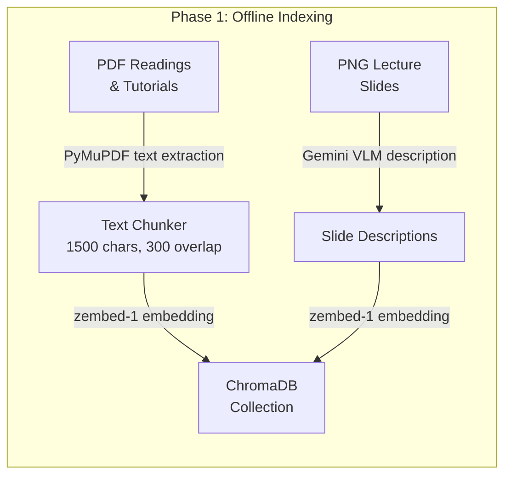
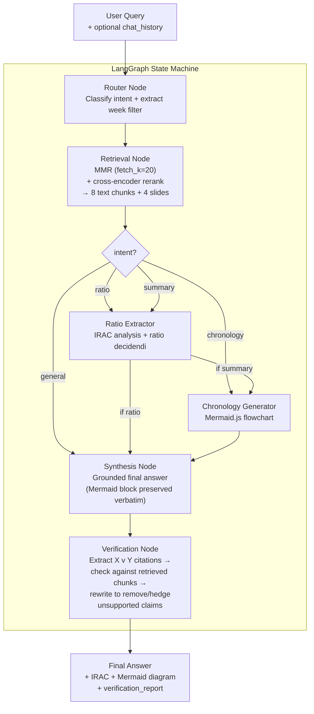
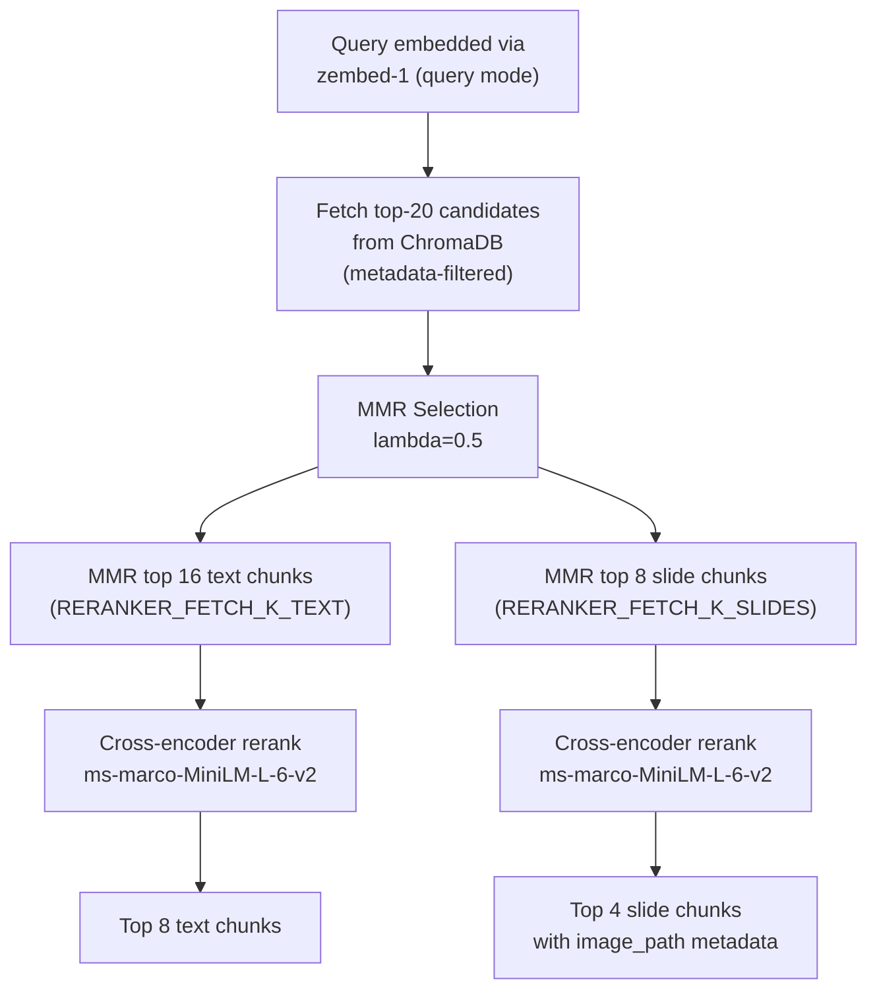
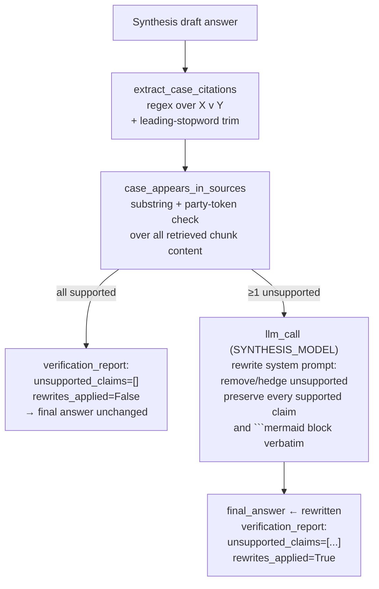
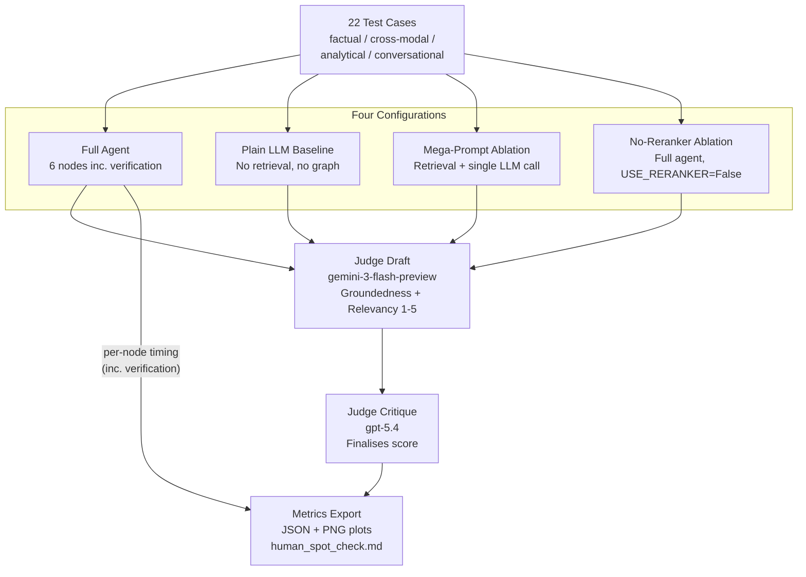

# Architecture

## System Overview

ashGPT is a multimodal LangGraph agent that processes property law queries through a conditional state machine. The architecture separates retrieval, legal rule extraction, and chronological analysis into distinct cognitive nodes, enabling ablation studies and independent evaluation of each component.

Multi-turn conversation is supported via a `chat_history` field in the agent state: prior turns are trimmed, validated, and packed into retrieval queries and node prompts so the agent can resolve follow-up questions without conflating history with new retrieval evidence.

## Data Flow



## Agent Pipeline



### Intent routing rules

| Intent | Trigger | Node path |
|--------|---------|-----------|
| `ratio` | User asks for ratio decidendi, binding rule, or IRAC analysis | Retrieval → Ratio Extractor → Synthesis → Verification |
| `chronology` | User asks *only* for a diagram, timeline, or flowchart (no broader explanation) | Retrieval → Chronology → Synthesis → Verification |
| `summary` | User asks for an explanation/overview **or** combines a timeline request with any explanatory goal (e.g. "sequence of events and provide a summary") | Retrieval → Ratio Extractor → Chronology → Synthesis → Verification |
| `general` | Greetings, meta-questions, off-topic | Retrieval → Synthesis → Verification |

Verification runs unconditionally after synthesis (gated globally by `USE_VERIFICATION` in `src/config.py`). It is a cheap pass when no unsupported citations are found (regex only, no LLM call); it only invokes the synthesis model again on cases where it has to rewrite.

## State Schema

The `AgentState` TypedDict carries all data between nodes:

```mermaid
graph LR
    subgraph inputState ["Input"]
        Query["query: str"]
        Week["week_filter: str | None"]
        History["chat_history: list[ChatMessage]"]
    end

    subgraph routerState ["Router Output"]
        Intent["intent: ratio | chronology | summary | general"]
    end

    subgraph retrievalState ["Retrieval Output"]
        Texts["retrieved_texts: list[RetrievedDocument]"]
        SlidesDocs["retrieved_slides: list[RetrievedDocument]"]
    end

    subgraph ratioState ["Ratio Extractor Output"]
        Ratio["ratio_decidendi: str"]
        IRAC["irac_analysis: str"]
    end

    subgraph chronoState ["Chronology Output"]
        Mermaid["mermaid_diagram: str"]
        ChronoSummary["chronology_summary: str"]
    end

    subgraph synthState ["Synthesis Output"]
        Answer["final_answer: str"]
    end

    subgraph verifState ["Verification Output"]
        VerReport["verification_report: dict\n  unsupported_claims: list[str]\n  rewrites_applied: bool"]
    end

    subgraph diagState ["Diagnostics"]
        Trace["node_trace: list[str]"]
        UseRerank["use_reranker: bool\n(eval override; falls back to USE_RERANKER)"]
    end

    inputState --> routerState --> retrievalState --> ratioState --> chronoState --> synthState
    synthState --> verifState --> diagState
```



`ChatMessage` is `{role: "user" | "assistant", content: str}`. History is trimmed to a maximum of 24 messages and 3500 chars per message before being packed into the state.

## Retrieval Strategy



The two-stage design preserves MMR's diversity property — the reranker scores from a *diverse* pool rather than a redundant similarity pool — while the cross-encoder pass restores the precision that MMR sacrifices for diversity. The reranker is gated by `USE_RERANKER` in `src/config.py` and can be flipped per-run via the `use_reranker` state field; the no-reranker eval ablation uses this hook to attribute the precision contribution.

On follow-up turns, `build_retrieval_query` prepends an excerpt of the last assistant turn (up to 1200 chars) to the embedding query so the vector search can resolve pronouns and contextual references without losing focus on the new question.

## Verification Strategy



The check is cheap when nothing needs fixing — the regex and substring lookups run in microseconds. A second LLM call only fires when at least one citation is unsupported. Failure of the rewrite call is caught and the draft answer is preserved, with `rewrites_applied=False` recorded.

## Multi-Turn Chat Memory

`chat_memory.py` handles three concerns independently:

- **`prepare_chat_history_for_run`** — normalises roles, strips empty messages, truncates long turns, and caps the window at 24 messages before the history enters the state.
- **`format_transcript_for_llm`** — renders history as numbered `Student` / `Tutor` lines injected into router, ratio-extractor, chronology, and synthesis prompts.
- **`build_retrieval_query`** — constructs a focused embedding string for the retrieval node; on follow-ups it adds a brief prior-answer excerpt so the vector query can resolve implicit references.

The current user message always lives in `query`; prior turns live in `chat_history`. This keeps retrieval embeddings clean while still giving LLM nodes conversational context.

## Streamlit Frontend

The UI (`app.py`) renders each assistant message through a `render_message()` helper that splits the stored content on ` ```mermaid ``` ` fences:

- Text segments → `st.markdown`
- Mermaid fences → `st_mermaid` (interactive diagram)

This ensures diagrams render correctly both on first delivery and when the chat history is replayed on subsequent turns. The raw Mermaid code is also available in a collapsible expander for copy-to-mermaid.live.

## Model Assignments

| Node / Role | Model | Rationale |
|-------------|-------|-----------|
| VLM (slide indexing) | `gemini-2.5-pro` | Multimodal; describes slide images at index time |
| Router | `gemini-3.1-flash-lite-preview` | Lightweight classifier; low latency |
| Ratio Extractor | `gpt-5.3-chat-latest` | Mid-tier; structured IRAC output |
| Chronology | `gemini-3-flash-preview` | Lightweight; Mermaid generation |
| Synthesis | `gpt-5.4-mini` | Strong reasoning; grounded final answer |
| Verification rewrite | `gpt-5.4-mini` (same as synthesis) | Consistent voice when rewriting unsupported claims |
| Reranker | `cross-encoder/ms-marco-MiniLM-L-6-v2` | Small, fast, off-the-shelf; runs on `mps` / CPU |
| Eval baseline | `gpt-5.4-mini` | Same model as synthesis for fair comparison |
| Judge (draft) | `gemini-3-flash-preview` | Cross-provider stage-1 judgment |
| Judge (critique) | `gpt-5.4` | Stage-2 critique and score finalisation |

## Evaluation Framework



### Query families

| Family | Description |
|--------|-------------|
| `factual_retrieval` | Recall of specific cases, statutes, or holdings from the knowledge base |
| `cross_modal_retrieval` | Questions whose answer depends on a lecture slide diagram or figure |
| `analytical_synthesis` | Multi-step reasoning requiring IRAC or chronological analysis |
| `conversational_followup` | Follow-up turns that resolve pronouns against prior conversation |

### Metrics collected per run

- Groundedness (LLM-as-judge, 1–5)
- Answer relevancy (LLM-as-judge, 1–5)
- Context Precision@K, MRR, Hit@K, NDCG@K (binary relevance, LLM-judged)
- Optional recall-vs-pool (`--retrieval-pool-eval`, expanded retrieve + judge)
- Source diversity (unique sources retrieved)
- Total latency (seconds)
- Per-node latency breakdown (full agent, **including the verification node**)
- Node trace (which nodes fired per query)
- Cross-modal retrieval diagnostics on slide-targeted cases
- Verification telemetry: per-case `unsupported_claims` + `rewrites_applied`, with a live `[verification]` counter logged after each case
- IRAC compliance is reported as *not applicable* for `chronology` / `general` intents and excluded from the per-config average; the summary also exports `irac_applicable_count` and `irac_not_applicable_count`

## Key Design Decisions

| Decision | Rationale |
|----------|-----------|
| Single ChromaDB collection | Simpler retrieval with metadata filtering vs separate collections per week |
| MMR over similarity search | Balances relevance with source diversity; configurable for ablation |
| MMR → cross-encoder rerank (two-stage) | Preserves diversity in the candidate pool; restores precision by re-scoring against the query. Reranker is a small off-the-shelf cross-encoder kept as a lazy singleton |
| `use_reranker` state field as ablation hook | Lets the eval flip the reranker per-run without monkey-patching the global config — the basis for the `ablation_no_reranker` configuration |
| Separate per-node model assignments | Allows independent model swapping for ablation; lightweight models on cheap nodes |
| `summary` intent runs both reasoning nodes | A query asking for "sequence of events and a summary" needs both the Mermaid diagram and the IRAC analysis; routing to `summary` instead of `chronology` guarantees both fire |
| PRIMARY vs DERIVED evidence split in synthesis | Prevents the synthesis node from treating IRAC inferences as ground-truth facts |
| Verification after synthesis (regex + rewrite) | Catches the residual failure mode where synthesis cites a Property Law case absent from the retrieved chunks. Cheap when nothing is wrong; one LLM rewrite call when something is. Failure of the rewrite is caught and the draft is preserved |
| Verification rewrite preserves `\`\`\`mermaid` verbatim | The verification system prompt mandates that supported claims, headings, and any Mermaid code block survive the rewrite untouched — the diagram channel is never lost as a side-effect of fact-checking |
| Mermaid block preserved verbatim in synthesis | Synthesis system prompt and user prompt both mandate verbatim copy of the `\`\`\`mermaid` block — prevents the LLM from converting diagrams to bullet points |
| `render_message()` in Streamlit | All message renders (live and history replay) go through the same helper so diagrams survive multi-turn conversations |
| `chat_history` separate from `query` | Keeps retrieval embeddings focused on the current question while still giving LLM nodes conversational context |
| Deterministic document IDs | Safe re-indexing without duplicates |
| `node_trace` in state | Tracks which nodes fired per query for ablation comparison and latency breakdown |
| IRAC compliance returns *not applicable* for `chronology` / `general` | These intents legitimately do not produce IRAC structure; counting a zero would penalise the metric unfairly. The summary excludes N/A from the average and reports applicable / not-applicable counts separately |
| Human spot-check log auto-generated | Five cases sampled deterministically (`seed=4205`) for human re-rating; supports qualitative validation of the LLM-as-a-judge pipeline with a small MAE / disagreement table |

## Beyond Property Law

The hypothesis is framed around *ratio decidendi* and chronological flowcharts, but the architectural claim it tests is domain-agnostic: **separating structurally distinct outputs into specialised nodes improves grounding versus a single mega-prompt**. This section sketches what a port to another domain would look like, using **medical case reasoning** as the worked example.

### What stays the same

- The five-stage spine: **router → retrieval → specialised reasoning node(s) → synthesis → verification**.
- The PRIMARY-vs-DERIVED distinction in the synthesis prompt, which prevents node-generated artefacts from being treated as ground-truth facts.
- The ablation pattern: a **mega-prompt** baseline (one consolidated LLM call) and a **no-reranker** ablation, run alongside the full agent on the same cases, judged by a cross-provider two-stage LLM judge with a small human spot-check log for qualitative validation.
- The verification node: extract structured claim tokens from the final answer, look them up in the retrieved sources, and rewrite to remove or hedge unsupported claims.
- The metrics shape: groundedness, answer relevancy, context precision\@K, MRR / NDCG, latency, source diversity, structural validity of the structured artefacts.

### What changes when porting to medical case reasoning

| Layer | Property Law (current) | Medical case reasoning (port) |
|-------|------------------------|--------------------------------|
| **Router classes** | `ratio` / `chronology` / `summary` / `general` | `differential` / `timeline` / `guideline_application` / `general` |
| **Specialised nodes** | Ratio Extractor (IRAC), Chronology Generator (Mermaid) | Differential Ranker (ICD-10 weighted list), Clinical Timeline (Mermaid or Gantt), Guideline Mapper (e.g. NICE / RACGP rule application) |
| **Retrieval modalities** | PDF readings + VLM-described lecture slides | EHR text (notes, labs, discharge summaries) + radiology images described by a VLM (chest x-ray, MRI) + structured codes (ICD-10, SNOMED) |
| **Structural validators** | Mermaid validity, IRAC component coverage | Differential is a ranked list with weights summing to 1; timeline events have ISO-8601 dates; guideline citation maps to a known rulebook ID |
| **Verification node** | Extract case citations (`X v Y`); check against retrieved chunk text | Extract clinical claims (drug name, dose, recommendation tier) and verified guideline IDs; check each against the retrieved guideline chunks |
| **Per-node models** | Lightweight router/chronology, mid-tier ratio, strong synthesis | Same shape, but with a clinically-tuned synthesis model (or a model with the appropriate compliance posture) |
| **Eval families** | factual / cross-modal / analytical / conversational | factual lookup / cross-modal (image + note) / multi-source synthesis / multi-turn handover |

### Why the pattern carries over

The argument generalises because the failure mode it addresses — a single prompt being asked to produce multiple structurally distinct artefacts and silently trading one for another — appears in every domain where the answer is **a composition of structured outputs grounded in a heterogeneous corpus**. Property Law happens to make that failure visible (a missing ratio is glaring; a Mermaid diagram converted to bullet points is glaring). Medicine makes it costly (a missing differential entry, a wrong dose). Financial regulation makes it auditable (a missing control mapping is a finding). The cognitive separation is the same lever in each case; only the validators and the retrieval surfaces change.
