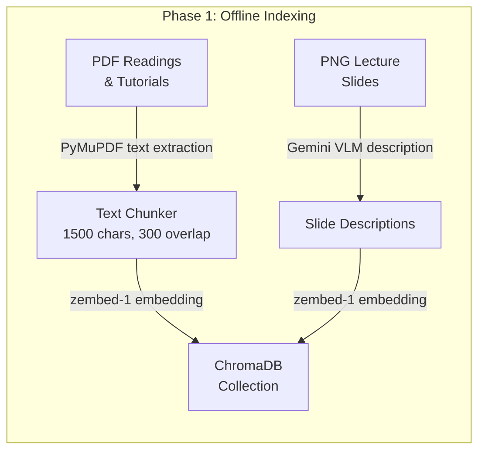
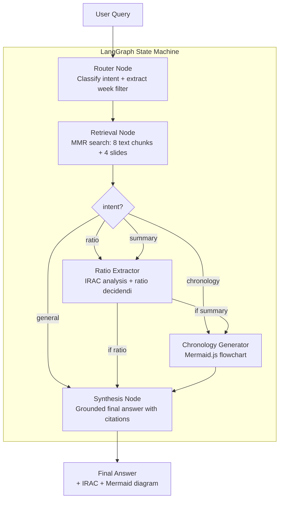
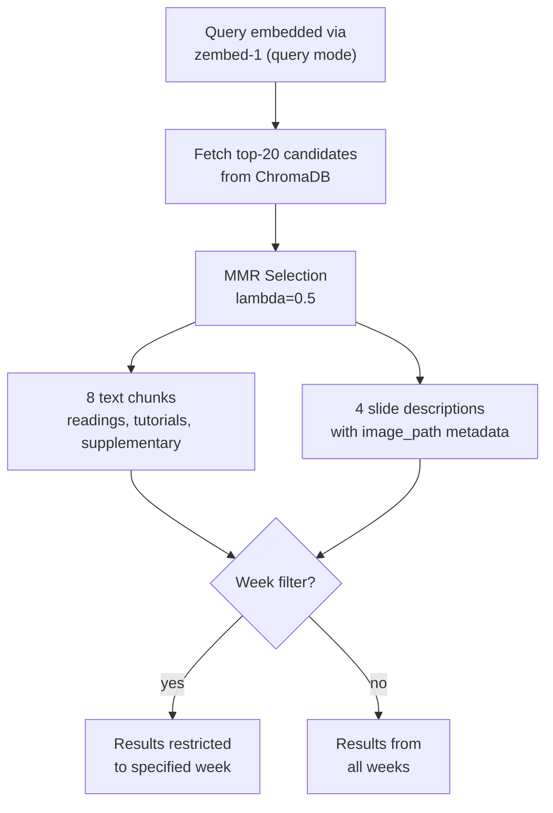
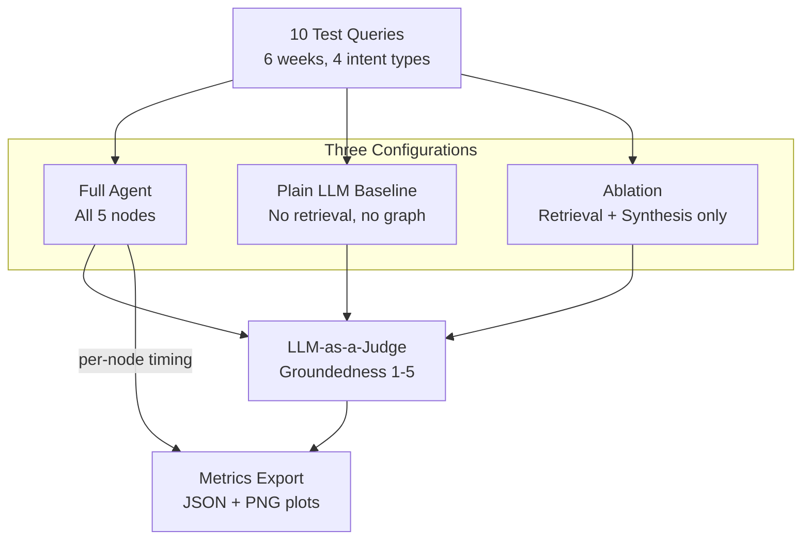

# Architecture

## System Overview

ashGPT is a multimodal LangGraph agent that processes property law queries through a conditional state machine. The architecture separates retrieval, legal rule extraction, and chronological analysis into distinct cognitive nodes, enabling ablation studies and independent evaluation of each component.

## Data Flow

## Agent Pipeline

## State Schema

The `AgentState` TypedDict carries all data between nodes:

```mermaid
graph LR
    subgraph inputState ["Input"]
        Query["query: str"]
        Week["week_filter: str | None"]
    end

    subgraph routerState ["Router Output"]
        Intent["intent: ratio | chronology | summary | general"]
    end

    subgraph retrievalState ["Retrieval Output"]
        Texts["retrieved_texts: list"]
        SlidesDocs["retrieved_slides: list"]
    end

    subgraph ratioState ["Ratio Extractor Output"]
        Ratio["ratio_decidendi: str"]
        IRAC["irac_analysis: str"]
    end

    subgraph chronoState ["Chronology Output"]
        Mermaid["mermaid_diagram: str"]
        ChronoSummary["chronology_summary: str"]
    end

    subgraph synthState ["Synthesis Output"]
        Answer["final_answer: str"]
    end

    subgraph diagState ["Diagnostics"]
        Trace["node_trace: list"]
    end

    inputState --> routerState --> retrievalState --> ratioState --> chronoState --> synthState
    synthState --> diagState
```

## Retrieval Strategy

## Evaluation Framework

## Key Design Decisions

| Decision | Rationale |
|----------|-----------|
| Single ChromaDB collection | Simpler retrieval with metadata filtering vs separate collections per week |
| MMR over similarity search | Balances relevance with source diversity; configurable for ablation |
| Separate VLM_MODEL and REASONING_MODEL | Allows independent model swapping for ablation studies |
| PRIMARY vs DERIVED evidence split in synthesis | Prevents the synthesis node from treating IRAC inferences as ground-truth facts |
| Deterministic document IDs | Safe re-indexing without duplicates |
| node_trace in state | Tracks which nodes fired per query for ablation comparison |
